# Project: Weather and Vacation
### "What's the weather like as we approach the equator?"

## Skills Used:
Python, Pandas, Matplotlib, Scipy, Python API (OpenWeatherMap API, Jupyter gmaps and the Google Places API)

## (Part-1) WeatherPy

### The objective is to find out if it gets hotter near the equator ot not?  

#### Tasks performed: 

#### (1)
- Wrote a Python script to obtain the weather of 500+ cities across the world of varying distance from the equator using CityPy, a simple Python library, and the OpenWeatherMap API.

- Randomly selects at least 500 unique (non-repeat) cities based on latitude and longitude.

- Performs a weather check on each of the cities using a series of successive API calls.

- Includes a print log of each city as it's being processed with the city number and city name.

- Saves the data retrieved from API calls into CSV files 

- Draw the scatter plots to visualize the relationship between various weather factors
    - Temperature (F) vs. Latitude
    - Humidity (%) vs. Latitude
    - Cloudiness (%) vs. Latitude 
    - Wind Speed (mph) vs. Latitude

- Save the scatter plots into PNG images

### Observable Trends

1. It has been found that there is a strong correlation between the latitude and the max temperature values. The weather tends to get hotter as we approach equator. However, the maximum temperature is not exactly at the equator but slightly above (approx. 20o – 25o) the equator.

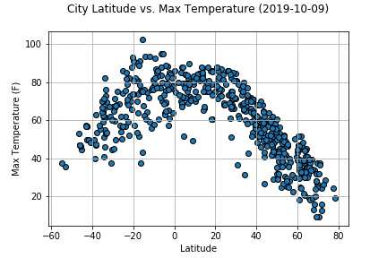

2. The humidity, cloudiness and wind speed do not seem to be correlated with latitude. 

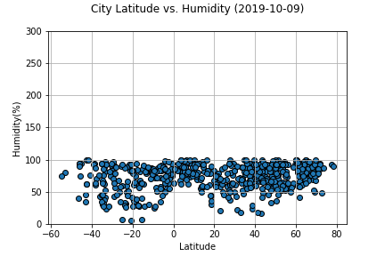
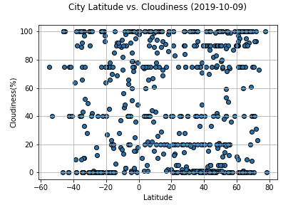
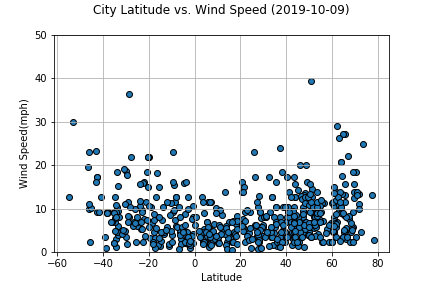

#### (2)
Other objective is to run linear regression on each relationship, by separating them into Northern Hemisphere (greater than or equal to 0 degrees latitude) and Southern Hemisphere (less than 0 degrees latitude):

- Filter the data based on Northern Hemisphere and Southern Hemisphere 
- Draw the scatter plots to visualize the relationship between various weather factors both on Northern and Southern Hemisphere
    - Northern Hemisphere - Temperature (F) vs. Latitude
    - Southern Hemisphere - Temperature (F) vs. Latitude
    - Northern Hemisphere - Humidity (%) vs. Latitude
    - Southern Hemisphere - Humidity (%) vs. Latitude
    - Northern Hemisphere - Cloudiness (%) vs. Latitude
    - Southern Hemisphere - Cloudiness (%) vs. Latitude
    - Northern Hemisphere - Wind Speed (mph) vs. Latitude
    - Southern Hemisphere - Wind Speed (mph) vs. Latitude
- Run the linear regression on each relationship
- Analysis of linear regression
- The visualizations include a series of scatter plots to showcase the following relationships:

### Observable Trends

#### 1. 

The scatter plot shows that the temperature decreases as we go farther from the equator (Northern Hemisphere)

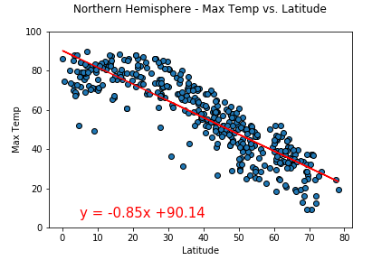

The scatter plot shows that the temperature increases as we go nearer towards the equator (Southern Hemisphere)

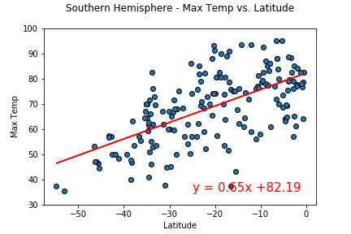

#### 2. 
The scatter plot shows that most of the cities that are nearer to the equator have higher humidity between 60% to 100%.
The humidity for cities that are slightly far from equator have mix of lower and higher densities (Northern Hemisphere) 

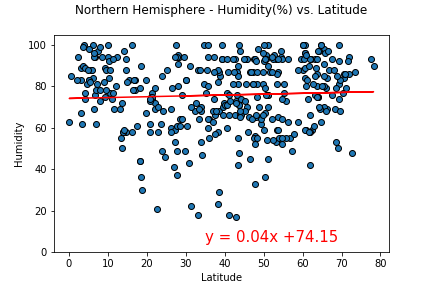

The scatter plot shows that most of the cities that are nearer to the equator have higher humidity between 60% to 100% (Southern Hemisphere)

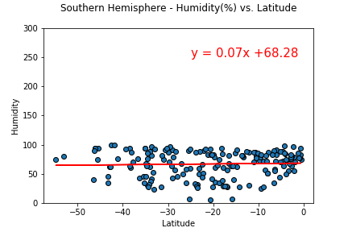

#### 3. 
The cloudiness is spready equally everywhere (Northern Hemisphere)

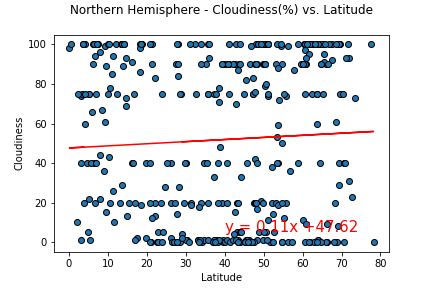 

The scatter plot shows no significant relationship between latitide and cloudiness (Southern Hemisphere)

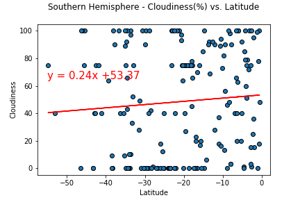

#### 4.
The scatter plot shows no significant relationship between latitide and wind speed (Northern Hemisphere)

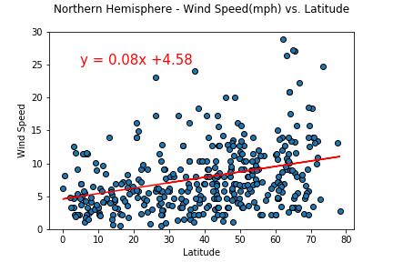

The scatter plot shows no significant relationship between latitide and wind speed (Southern Hemisphere)

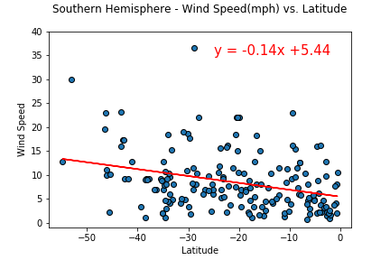

### Conclusion - Part 1

#### The analysis of data proves that :
- The weather becomes significantly warmer as one approaches the equator (0 Deg. Latititude). It also showed that the southern hempisphere tends to be warmer at the end of the year than the northern hemisphere. 
- There is no strong relationship between latitude and cloudiness, however, it is interesting to see that a strong band of cities sits at 0, 80, and 100% cloudiness.
- There is no strong relationship between latitude and wind speed, however in northern hemispheres there is a flurry of cities with over 20 mph of wind.

## (Part-2) VacationPy

### The objective is to plan future vacations based on Weather data gathered in  'WeatherPy' part of project. 

#### Tasks performed:

- Created a heat map that displays the humidity for every city.

 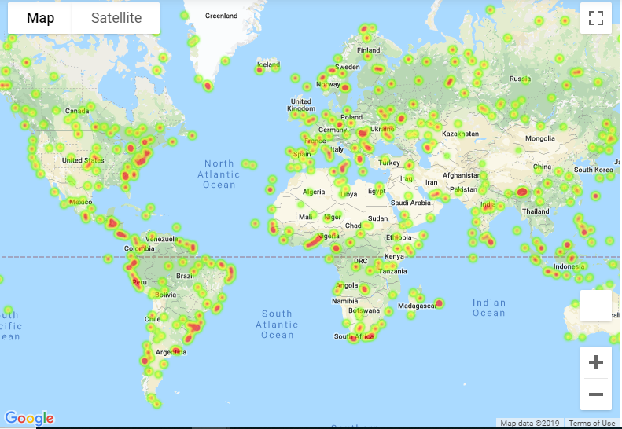

- Used Jupyter gmaps and the Google Places API for this part of project.
- Narrowed down the DataFrame to find the ideal weather condition. 
- Used Google Places API to find the first hotel for each city located within 5000 meters of the coordinates.
- Plotted the hotels on top of the humidity heatmap with each pin containing the Hotel Name, City, and Country.

 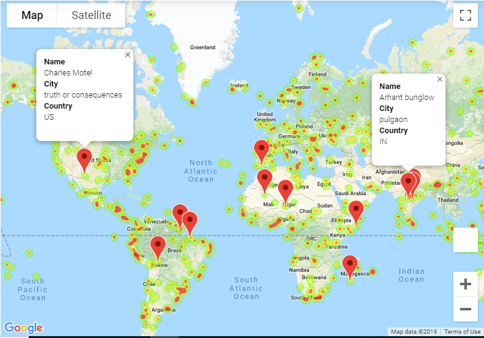

